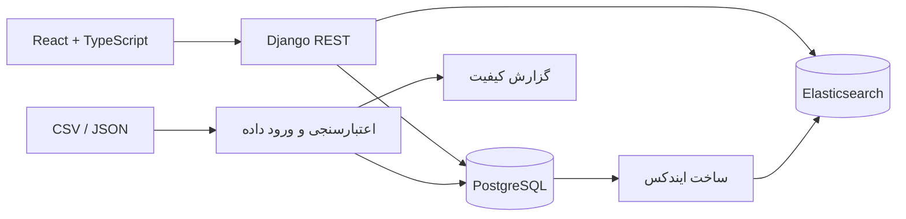
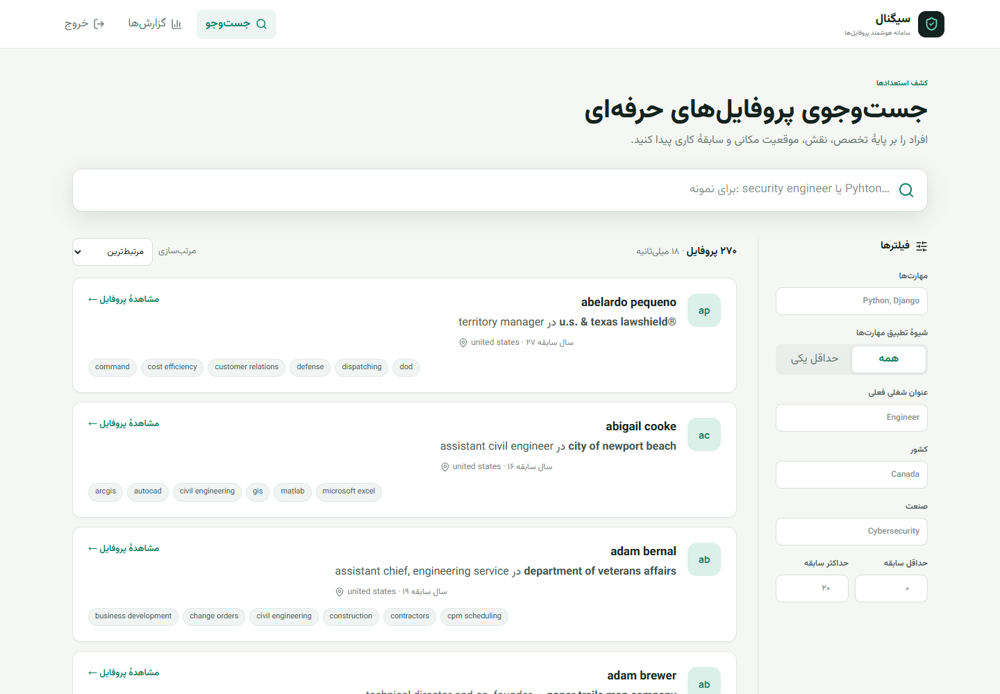

# سامانه جست‌وجو و تحلیل پروفایل‌ها

یک وب‌اپلیکیشن فول‌استک با رویکرد تولیدمحور برای جست‌وجوی پروفایل‌های حرفه‌ای است. PostgreSQL مرجع اصلی داده‌هاست و Elasticsearch جست‌وجوی رتبه‌بندی‌شده را در شغل فعلی، سوابق کاری و تحصیلی انجام می‌دهد. فیلترها، Facetها، برجسته‌سازی امن و توضیح علت تطبیق نیز در همین لایه فراهم شده‌اند.

## قابلیت‌های اصلی

- رتبه‌بندی دقیق، عبارتی، تمام‌متنی و جست‌وجوی فازی کنترل‌شده با وزن‌های هدفمند
- جست‌وجوی تودرتو در سوابق کاری و تحصیلی با `inner_hits`
- فیلتر مهارت با حالت «همه/حداقل یکی»، عنوان شغلی، کشور، صنعت و میزان سابقه
- Facet، برجسته‌سازی امن و نمایش علت تطبیق هر نتیجه
- واردکنندهٔ تکرارپذیر CSV/JSON همراه با اعتبارسنجی، ترمیم قابل‌ردیابی و گزارش قرنطینه
- صفحهٔ جزئیات، اطلاعات تماس، خط زمانی سوابق و داشبورد تحلیلی تعاملی
- نگهداری توکن دسترسی JWT در حافظه و توکن نوسازی در کوکی HttpOnly
- رابط React واکنش‌گرا، دسترس‌پذیر، فارسی و راست‌به‌چپ با وضعیت جست‌وجوی همگام با نشانی صفحه
- راه‌اندازی یک‌مرحله‌ای با Docker، مستندات OpenAPI، آزمون‌ها و CI

## اجرای سریع

پیش‌نیاز: Docker Desktop با حداقل ۲ گیگابایت حافظهٔ آزاد.

```bash
docker compose up --build
```

نشانی <http://localhost:8080> را باز کنید و با اطلاعات زیر وارد شوید:

```text
نام کاربری: reviewer
رمز عبور: ProfileSearch2026!
```

در نخستین اجرا، مهاجرت‌های PostgreSQL اعمال می‌شوند، حساب ارزیابی ساخته می‌شود، دیتاست واقعی `data/raw/linkedin_profiles.csv` وارد می‌شود، فایل `reports/import-report.json` تولید می‌شود، ایندکس Elasticsearch ساخته می‌شود و برنامه بالا می‌آید. تمام این مراحل تکرارپذیرند.

برای استفاده‌ای شبیه محیط تولید، فایل `.env.example` را با نام `.env` کپی و همهٔ اطلاعات محرمانه را تغییر دهید. مقادیر پیش‌فرض Compose فقط برای ساده‌کردن ارزیابی محلی در نظر گرفته شده‌اند.

## معماری



جزئیات بیشتر در [سند معماری](docs/architecture.md) و [گزارش کیفیت داده](docs/data-quality-report.md) آمده است.

## نمای برنامه



## طراحی جست‌وجو

مسیر `GET /api/profiles/search` فقط پارامترهای اعتبارسنجی‌شدهٔ دامنه را می‌پذیرد و کاربر نمی‌تواند Query DSL خام به Elasticsearch ارسال کند. Query Builder محدودیت‌های بدون امتیاز را در `bool.filter` قرار می‌دهد و موارد زیر را ترکیب می‌کند:

1. تطبیق دقیق نام و مهارت با وزن‌های ۸ و ۷؛
2. تطبیق عبارتی عنوان و شرکت فعلی با وزن‌های ۶ و ۴؛
3. تطبیق وزن‌دار چندفیلدی؛
4. تطبیق تودرتوی سوابق کاری و تحصیلی؛
5. جست‌وجوی فازی با وزن پایین برای خطاهای تایپی معمول.

سوابق کاری و تحصیلی در Elasticsearch به‌صورت `nested` ذخیره می‌شوند؛ بنابراین عنوان یک سابقه با شرکت سابقه‌ای دیگر به‌اشتباه ترکیب نمی‌شود. نشانه‌های برجسته‌سازی به شکل `[[H]]…[[/H]]` هستند. React فقط این نشانه‌ها را به عنصر `<mark>` تبدیل می‌کند و هیچ HTML دریافتی را مستقیماً نمایش نمی‌دهد.

نمونه:

```http
GET /api/profiles/search?q=security&skills=Python,Elasticsearch&skills_mode=all&country=Iran&page=1&page_size=20
```

## ورود و نرمال‌سازی داده

دیتاست اولیه بدون تغییر در `data/raw/linkedin_profiles.csv` نگهداری می‌شود. اجرای دستی فرایند ورود و ساخت مجدد ایندکس:

```bash
docker compose exec backend python manage.py import_profiles /data/raw/linkedin_profiles.csv --report /reports/import-report.json
docker compose exec backend python manage.py reindex_profiles
```

واردکننده از CSV و JSON پشتیبانی می‌کند. مقادیر تودرتوی شبیه JSON یا Python literal فقط با `json.loads` و `ast.literal_eval` خوانده می‌شوند و هرگز از `eval` استفاده نمی‌شود. فقط موارد قابل‌اثبات، مانند ستون اضافهٔ مسیر منبع یا شغل فعلی قابل‌بازیابی از سابقهٔ اصلی، ترمیم می‌شوند. ردیف نامعتبر به‌جای متوقف‌کردن کل فرایند قرنطینه می‌شود.

در اجرای بررسی‌شده، از ۳۳۶ ردیف خام، ۳۰۷ ردیف پذیرفته و ۲۹ ردیف خراب قرنطینه شدند. پس از شناسایی ۳۷ رکورد تکراری، ۲۷۰ پروفایل یکتا ذخیره شد. جزئیات در گزارش کیفیت داده ثبت شده است.

## رابط برنامه‌نویسی

| روش | مسیر | کاربرد |
|---|---|---|
| POST | `/api/auth/login` | دریافت توکن دسترسی و کوکی نوسازی |
| POST | `/api/auth/refresh` | نوسازی و چرخش توکن دسترسی |
| POST | `/api/auth/logout` | حذف کوکی نوسازی |
| GET | `/api/auth/me` | دریافت کاربر جاری |
| GET | `/api/profiles/search` | جست‌وجو، فیلتر، Facet و صفحه‌بندی |
| GET | `/api/profiles/{id}` | جزئیات نرمال‌شدهٔ پروفایل |
| GET | `/api/search/suggestions` | پیشنهاد مهارت و عنوان شغلی |
| GET | `/api/analytics/overview` | داده‌های تجمیعی داشبورد |
| GET | `/api/health` | وضعیت پایگاه داده و موتور جست‌وجو |
| GET | `/api/docs/` | رابط تعاملی Swagger |

همهٔ مسیرهای برنامه، به‌جز ورود، نوسازی توکن و بررسی سلامت، به احراز هویت نیاز دارند. مقدار `page_size` حداکثر ۵۰ است.

## توسعه و آزمون

بک‌اند (Python 3.13 پیشنهاد می‌شود):

```bash
cd backend
python -m venv .venv
.venv/Scripts/pip install -r requirements.txt
pytest
ruff check .
```

فرانت‌اند (Node 24):

```bash
cd frontend
npm ci
npm run lint
npm test
npm run build
```

انتظارهای کیفیت جست‌وجو در `tests/search_cases.json` ثبت شده‌اند. آزمون‌های Query Builder نیز جای‌گذاری فیلترها، رفتار همه/حداقل یکی، جست‌وجوی سوابق تودرتو و وزن‌های رتبه‌بندی را بررسی می‌کنند.

## تصمیم‌های امنیتی

- توکن دسترسی کوتاه‌عمر در حافظه و توکن نوسازی در کوکی HttpOnly و SameSite نگهداری می‌شود.
- ورود کاربر محدودیت نرخ دارد و اندازهٔ صفحه و همهٔ پارامترهای عمومی جست‌وجو محدود شده‌اند.
- Elasticsearch درگاه میزبان ندارد و فقط در شبکهٔ داخلی Compose در دسترس است.
- دادهٔ خام، اطلاعات حساس، رمز عبور و توکن‌ها عمداً لاگ نمی‌شوند و در API فهرست نتایج برنمی‌گردند.
- Nginx و Django سرآیندهای امنیتی را تنظیم می‌کنند و CORS به مبدأهای مشخص محدود است.
- برجسته‌سازی جست‌وجو همیشه متن در نظر گرفته می‌شود و HTML خام نیست.

برای استقرار با HTTPS، مقدار `DJANGO_DEBUG=false` را تنظیم کنید، کلید امن بسازید، میزبان‌ها و مبدأهای مجاز را دقیق وارد کنید و TLS را جلوی Nginx پایان دهید تا کوکی نوسازی با ویژگی `Secure` باقی بماند.

## ملاحظات فنی

- در مقیاس ۳۳۶ رکورد، PostgreSQL به‌تنهایی برای جست‌وجو کافی بود؛ بااین‌حال Elasticsearch برای رتبه‌بندی قابل‌دفاع، Query DSL، دادهٔ تودرتو و تجمیع‌ها استفاده شده و یک ایندکس بازسازی‌پذیر باقی می‌ماند.
- Zustand وضعیت کاربر و نشست را مدیریت می‌کند و TanStack Query مسئول داده‌های سرور است؛ پاسخ‌های API دوباره در Store عمومی کپی نمی‌شوند.
- REST قرارداد را کوچک و روشن نگه می‌دارد. GraphQL، Redis و MongoDB در این مقیاس کاربرد موجهی ندارند.
- ساخت هم‌زمان ایندکس هنگام راه‌اندازی برای چندصد پروفایل ساده و قابل‌اعتماد است. مجموعه‌دادهٔ بزرگ به صف یا خط لولهٔ رویدادمحور نیاز دارد.

## محدودیت‌های شناخته‌شده

- ۲۹ ردیف خراب منبع، به‌جای ترمیم حدسی، قرنطینه می‌شوند و شماره و علت ردشدنشان در گزارش آمده است.
- خروج، کوکی مرورگر را حذف می‌کند اما فهرست سیاه سمت سرور ندارد؛ زیرا برنامه مسیر دامنه‌ای تغییردهندهٔ داده ندارد.
- تکمیل خودکار از جست‌وجوی زیررشته‌ای PostgreSQL استفاده می‌کند؛ جست‌وجوی رتبه‌بندی‌شده و تجمیع‌های داشبورد با Elasticsearch انجام می‌شوند.
- آزمون مرورگر سرتاسری پس از پوشش اصلی واحد و یکپارچه در اولویت بعدی قرار دارد.

## نکات مقیاس‌پذیری

برای میلیون‌ها پروفایل باید Workerهای ورود داده، Outbox یا جریان رویداد، مهاجرت ایندکس بدون توقف با Alias، تنظیم Shardها، `search_after`، پایش‌پذیری و Cache انتخابی پس از اندازه‌گیری گلوگاه‌ها اضافه شوند. هیچ‌یک برای اندازهٔ فعلی ضروری نیستند.

## سناریوهای پیشنهادی ارزیابی

1. عبارت `security engineer` را جست‌وجو کنید، فیلتر مهارت را اعمال کنید و میان حالت «همه» و «حداقل یکی» جابه‌جا شوید.
2. عبارت `Pyhton` را جست‌وجو کنید تا جست‌وجوی فازی کنترل‌شده دیده شود.
3. عبارت `project manager` را جست‌وجو و تطبیق نقش فعلی را با سابقهٔ تاریخی مقایسه کنید.
4. یکی از نتایج را باز کنید و سوابق نرمال‌شده، تحصیلات و اطلاعات تماس را ببینید.
5. در بخش گزارش‌ها روی میلهٔ مهارت یا صنعت کلیک کنید تا فیلتر متناظر به صفحهٔ جست‌وجو منتقل شود.
