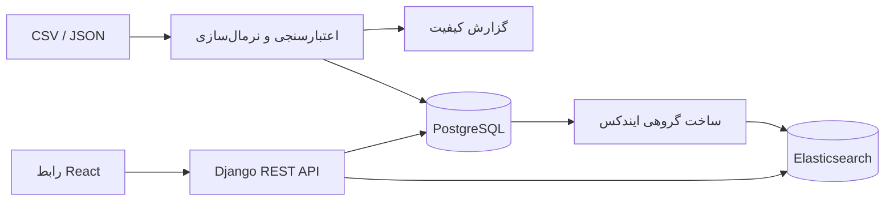

# معماری سامانه

PostgreSQL مرجع اصلی داده‌هاست. Elasticsearch فقط نمای جست‌وجوی بازسازی‌پذیر داده‌هاست و حذف آن باعث ازبین‌رفتن اطلاعات نمی‌شود. مرورگر نه اطلاعات اتصال Elasticsearch را دریافت می‌کند و نه Query DSL خام می‌فرستد. API یک ساختار محدود و اعتبارسنجی‌شده از پارامترهای جست‌وجو می‌پذیرد و Query Builder آن را به DSL کنترل‌شده تبدیل می‌کند.

سوابق کاری و تحصیلی با نوع `nested` نگاشت می‌شوند. در نتیجه، عنوان و شرکت متعلق به دو سابقهٔ جداگانه نمی‌توانند یک تطبیق نادرست بسازند. بازسازی ایندکس صریح و مبتنی بر Bulk API است.

احراز هویت از توکن دسترسی کوتاه‌عمر در حافظه و توکن نوسازی در کوکی HttpOnly و SameSite استفاده می‌کند. قطعه‌های برجسته‌شدهٔ نتیجه با نشانه‌های خنثی `[[H]]` ساخته و با عناصر React نمایش داده می‌شوند؛ هیچ HTML خامی از موتور جست‌وجو در صفحه رندر نمی‌شود.
